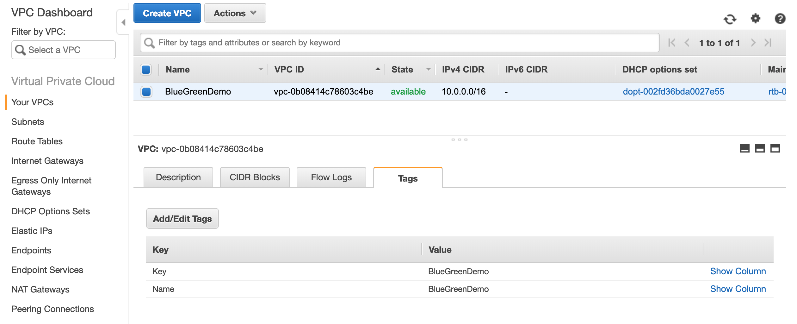
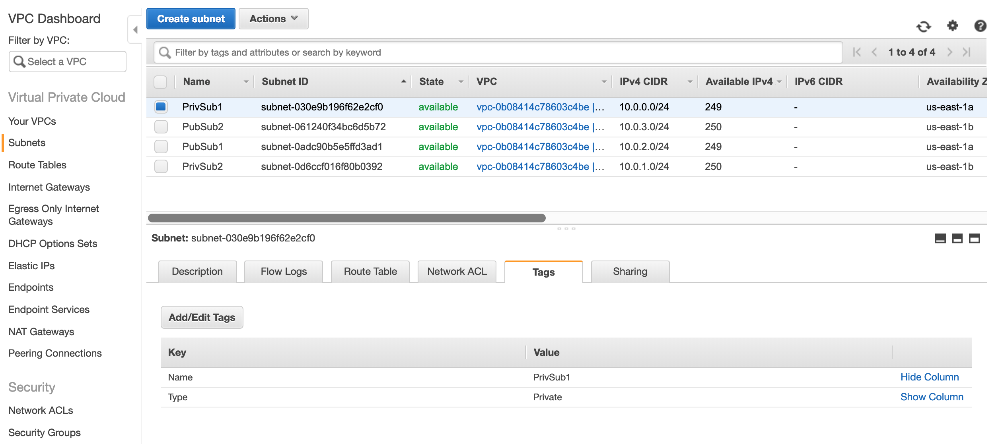
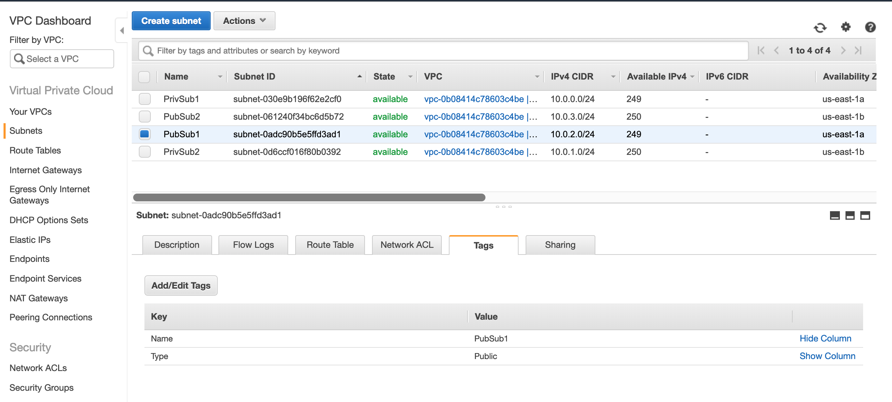
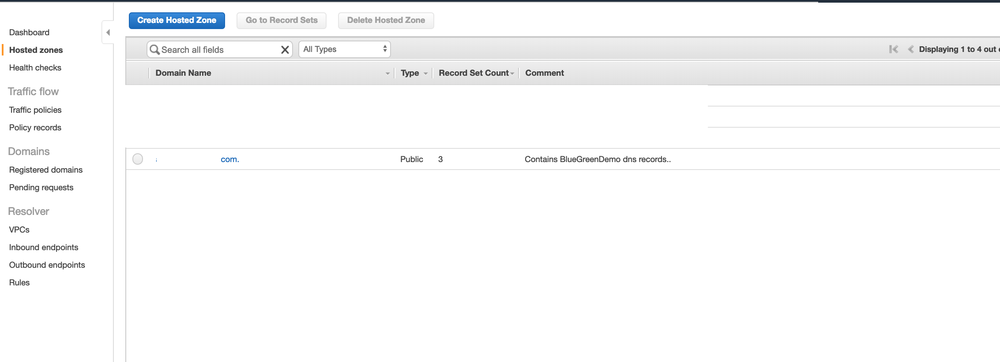
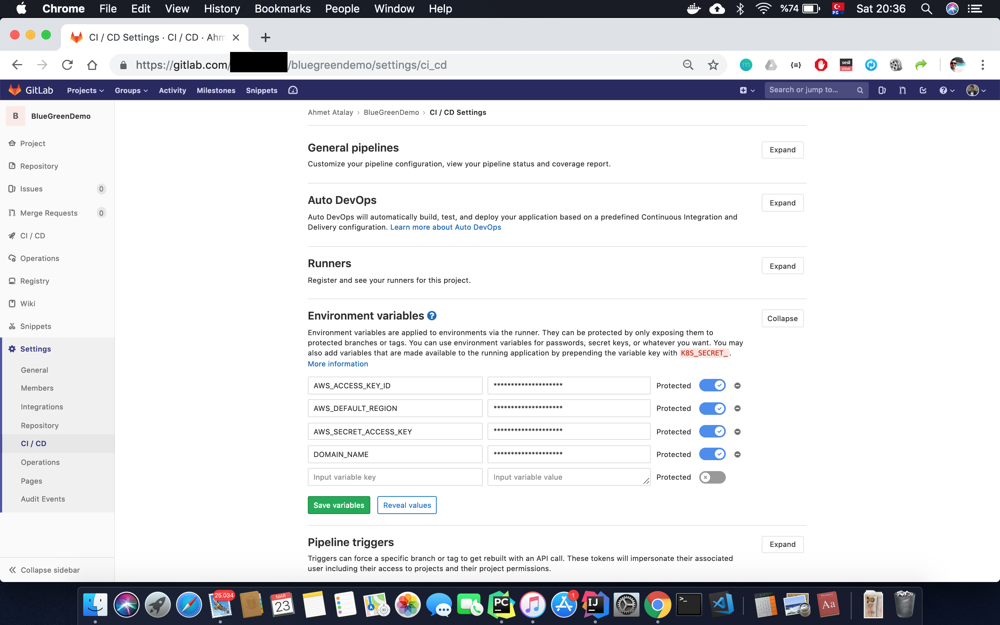
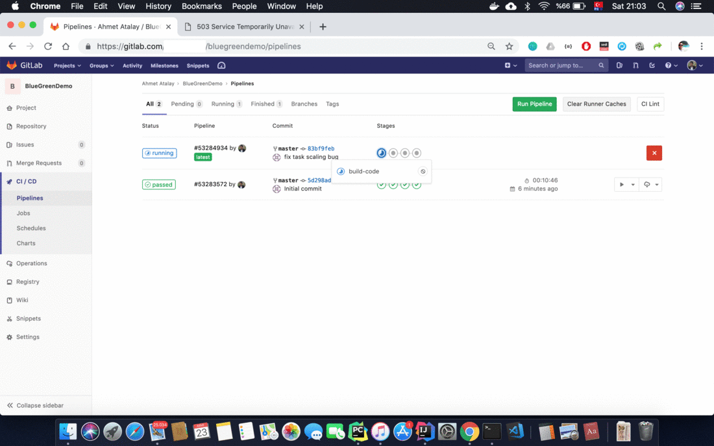
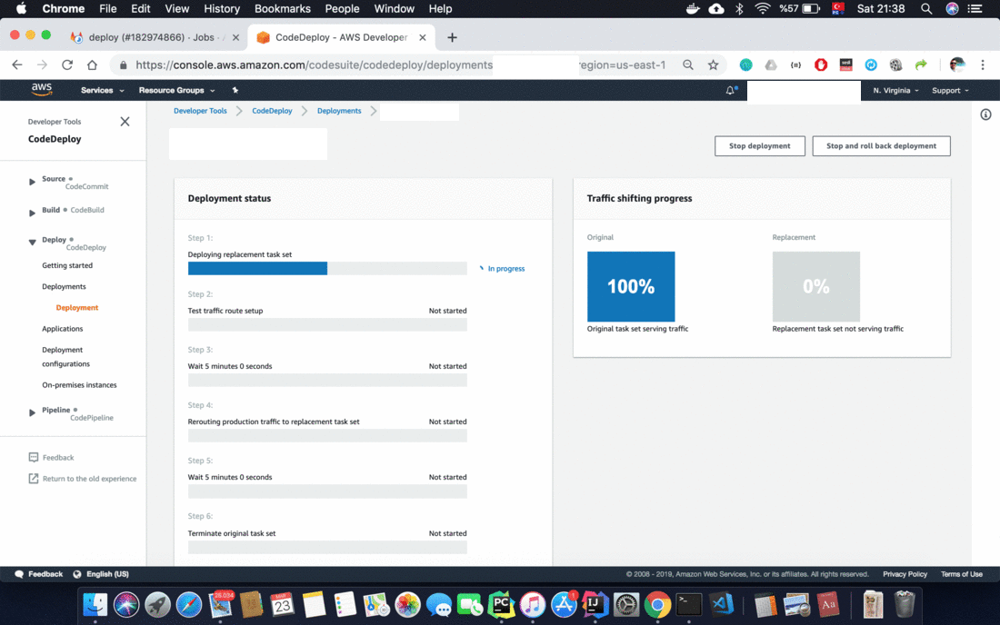

# About
Project contains sample spring boot hello world microservice with unit test & integration test.Project can be buit by gradle, and can be deployed to AWS by terraform 

Project has following CI stages:
 - build
   * It executes `gradle build` to compile, run tests and build package
 - dockerize
   * It gets the artifact(jar) from previous build step and put into docker image, then push to AWS ECR
 - deploy
   * It executes `terraform apply ` to deploy image to AWS ECS and trigger codedeploy
 - destroy
   * It executes `terraform destroy` to delete every resource. This step is manual, needs click to play button

# Prerequisites
 - Put the following tag into your VPC
   * Key = BlueGreenDemo
   
 - Put the following tags into your each Private Subnets(ECS Fargate tasks will use these subnets)
   * Type = Private
   
 - Put the following tags into your each Public Subnets(ALBs will use these subnets)
   * Type = Public
   
 - Buy domain from AWS Route53 and create Route 53 hosted zone with domain name(i.e. mycompany.com) or just only add nameservers of created hosted zone into your different hosting firm
   
 - Create IAM User with access key & secret keys. These will be used in Gitlab CI env vars as described below.

# How to use it?
After cloning this project, you have to do the following steps:
 - Push to your **Gitlab** repository.
 - Set the environment variables under project settings
   * AWS_ACCESS_KEY_ID  (access key of iam user)
   * AWS_SECRET_ACCESS_KEY  (secret key of iam user)
   * AWS_DEFAULT_REGION     (i.e.us-east-1)
   * DOMAIN_NAME (i.e.mycompany.com)
    
 - Commit to your project, and pipeline will automatically start.You can reach to your app with mybgapp.<yourdomain_name.com>(i.e. mybgapp.mycompany.com or mybgapp.mycompany.com:8080)
   
 - Check out your AWS codedeploy pipeline, then execute following steps according to your needs:
   * Switch traffic(80 port can access to new version of your app)
   * Terminate original task (deletes v1 of your app, after switch traffic)
   * Rollback(destroys your buggy v2 app)
   
   
   

  
   
